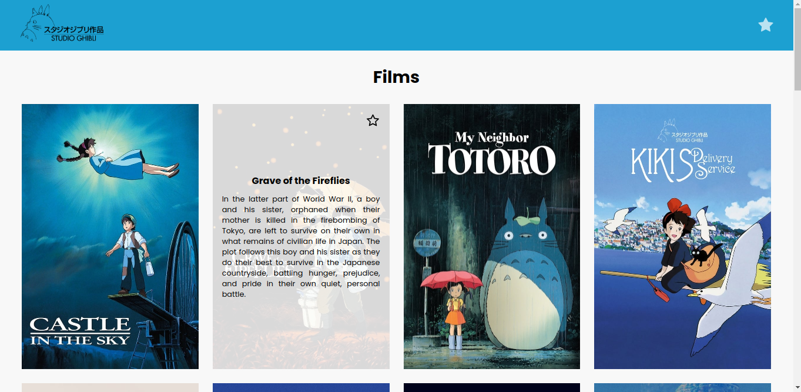

# Exercício Ghibli Animations

---

## Deploy
Você pode acessar a aplicação pelo seguinte link:

### [studio-ghibli-films-jpsc.surge.sh](https://studio-ghibli-films-jpsc.surge.sh)

---

## Proposta
Esse repositório contem uma aplicação React feita com o objetivo de praticar o conteúdo Context API durante o curso de desenvolvimento web na Trybe.

---

## A aplicação
A aplicação possui duas páginas, a página principal e uma página de favoritos.

A página principal lista os filmes do estúdio Ghibli Animations, seus títulos, imagens e descrições e permite que o usuário os favoritem.

A página de favoritos lista os filmes favoritados pelo usuário e permite que sejam desfavoritados.

---

## Tecnologias utilizadas
- ReactJS
- React Router DOM
- Context API
- CSS Modules
- React Icons
- Consulta a API

---